## 概念

这类问题一般都是在一维数组中依次选取**前后坐标无关的**`n`个值，且可以将**历史最优值或方案**浓缩为**有限**的状态，在限定条件下达到最优值，或统计在限制条件下合法的方案数。

>1. 选是1，不选是0
>2. 不是01背包，但是取名思路类似。

## 例题

### 1 最高乘法得分

>  LeetCode.3290
>  
> 给你一个大小为 4 的整数数组 `a` 和一个大小 **至少**为 4 的整数数组 `b`。
> 
> 你需要从数组 `b` 中选择四个下标 `i0`, `i1`, `i2`, 和 `i3`，并满足 `i0 < i1 < i2 < i3`。你的得分将是 `a[0] * b[i0] + a[1] * b[i1] + a[2] * b[i2] + a[3] * b[i3]` 的值。
> 
> 返回你能够获得的 **最大** 得分。

#### 做法

状态：$f_{i,k}$ 表示前 $i$ 数中，已经选择了 $k$ 个数字，所达到的最大值。

转移：
- 选择当前数字作为第 $k$ 个数字，那么就从 $f_{i - 1, k - 1}$ 转过来。
- 不选择当前数字，那么 $f_{i, k}$ 就是 $f_{i - 1, k}$ 。

#### 方程
$$
f_{i, k} =
\begin{cases}
0 & k = 0 \\
\max(f_{i - 1, k}, f_{i - 1, k - 1} + b_{i - 1} \cdot a_{k - 1}) & k > 0
 \end{cases}
$$
#### 代码

```cpp
int n = b.size(), m = a.size();
auto dp = vector(n + 1, vector(m + 1, -1e11));

dp[0][0] = 0;
for (int i = 1; i <= n; ++i) {
  for (int k = 0; k <= m; ++k) {
    dp[i][k] = dp[i - 1][k];
    if (k > 0) dp[i][k] = max(
      dp[i - 1][k], 
      dp[i - 1][k - 1] + 1ll * b[i - 1] * a[k - 1]
    );
  }
}
dout << dp;

cout << dp[n][m] << endl;
```

这里一开始写了一个错误的状态转移，原因还有非法状态 $k > i$ ，需要**禁止**这条转移 。
> Wrong Answer
>
>
> [3, 2, 5, 6]
> [2, -6, 4, -5, -3, 2, -7]
> [
>   [0, 0, 0, 0, 0],
>   [0, 6, 4, 10, 12],
>   [0, 6, 4, 10, 12],
>   [0, 12, 14, 24, 34],
>   [0, 12, 14, 24, 34],
>   [0, 12, 14, 24, 34],
>   [0, 12, 16, 24, 36],
>   [0, 12, 16, 24, 36]
> ]
>
>
> Accepted
> [3, 2, 5, 6]
> [2, -6, 4, -5, -3, 2, -7]
> [
>   [0, -INF, -INF, -INF, -INF],
>   [0, 6, -INF, -INF, -INF],
>   [0, 6, -6, -INF, -INF],
>   [0, 12, 14, 14, -INF],
>   [0, 12, 14, 14, -16],
>   [0, 12, 14, 14, -4],
>   [0, 12, 16, 24, 26],
>   [0, 12, 16, 24, 26]
> ]


#### 深度思考

注意到， $i$ 的所有状态，都是 $i - 1$ 转移来的，因此我们可以将状态分为**当前状态**和**历史状态**。
$$
\rm cur[k] = \max(his[k], his[k - 1] + a[k - 1] \cdot b[i - 1])
$$
==优势==：

- 不需要关注数组下标
- 节省内存

```cpp
vector<ll> his(m + 1, -1e11);
vector<ll> cur = his;

his[0] = 0;
for (int i = 1; i <= n; ++i) {
  for (int k = 0; k <= min(i, m); ++k) {
    cur[k] = his[k];
    if (k > 0) cur[k] = max(
      his[k],
      his[k - 1] + 1ll * b[i - 1] * a[k - 1]
    );
  }
  dout.sp(to_string(i));
  dout << cur;
  his = cur;
}

cout << cur[m] << endl;
```

### 2 最大的和

> 给定一个数组，有正有负，任选一些数字，使得和最大。

#### 做法

状态：$f_i$ 表示选到第 $i$ 个元素时的最大值。

转移：
- 选当前元素
- 不选当前元素

#### 方程

$$
f_i = 
\begin{cases}
\max(0, a_0) & i = 0 \\
\max(f_{i - 1}, f_{i - 1} + a_i) & i > 0
 \end{cases}
$$

#### 代码

```cpp
vector<int> f(n);
f[0] = max(0, a[0]);
for (int i = 1; i < n; ++i) {
  f[i] = max(f[i - 1], f[i - 1] + a[i]);
}
cout << f[n - 1] << endl;
```

```cpp
int his = 0, cur = 0;
for (int i = 0; i < n; ++i) {
  cur = max(his, his + a[i]);
  his = cur;
}
cout << cur << endl;
```


#### 深度思考

是不是只需要`his`就可以了？
```cpp
int his = 0;
for (int i = 0; i < n; ++i) {
  his = max(his, his + a[i]);
}
cout << his << endl;
```
### 3 最大的乘积

 > LeetCode.2708
 > 给定一个数组，有正有负，构成一个**非空**集，使得**乘积**最大。 

#### 做法

因为存在**负负得正**的情况，所以我们不能单纯的取正数。

状态：$f_{i,0/1}$ ，若只选取前 $i$ 个数字，$0$ 表示最小值，$1$ 表示最大值。

转移：
- 选取当前数字
- 不选当前数字
- 舍弃之前选择


#### 方程

$$
\begin{align}
& f_{0, 0} = f_{0, 1} = a[0] \\
& f_{i + 1, 0} = \max(x, f_{i, 0}, f_{i, 1} \cdot x, f_{i, 0} \cdot x) \\
& f_{i + 1, 1} = \max(x, f_{i, 1}, f_{i, 1} \cdot x, f_{i, 0} \cdot x) \\

\end{align}
$$
#### 代码

```cpp
auto f = vector(n, vector<ll>(2, 0));
f[0][1] = f[0][0] = a[0];
for (int i = 0; i + 1 < n; ++i) {
  f[i + 1][1] = max({
    f[i][1],
    f[i][1] * a[i + 1],
    f[i][0] * a[i + 1],
    1ll * a[i + 1],
  });

  f[i + 1][0] = min({
    f[i][0],
    f[i][0] * a[i + 1],
    f[i][1] * a[i + 1],
    1ll * a[i + 1],
  });
}
```

```cpp
vector<ll> his(2), cur(2);
his[0] = his[1] = a[0];
for (int i = 0; i + 1 < n; ++i) {
  ll x = a[i + 1];
  cur[1] = max({his[1], his[1] * x, his[0] * x, x});
  cur[0] = min({his[0], his[1] * x, his[0] * x, x});
  his = cur;
}

cout << his[1] << endl;
```

### 4 最大交替子序列和

> 给定一个数组，有正有负，从中选一些数字组成新数组，新数组的权值等于奇数位和减偶数位和，求最大权值。

#### 做法

状态：$f_{i,0/1}$ ，若只选取前 $i$ 个数字，$0$ 表示最小值，$1$ 表示最大值。

转移：
- 选取当前数字
- 不选当前数字
- 舍弃之前选择
![[最大交替子序列和.svg]]

如何转移：反转前面的结果，加上当前数字。

#### 方程

$$
f_{i, 0/1} = \min(x - f_{i, 0}, x - f_{i, 1}, f_{i, 0/1}, x);
$$
#### 代码

```cpp
vector<ll> his(2), cur(2);
his[0] = his[1] = a[0];
for (int i = 0; i + 1 < n; ++i) {
  ll x = a[i + 1];
  cur[1] = max({his[1], x - his[1], x - his[0], x});
  cur[0] = min({his[0], x - his[1], x - his[0], x});
  his = cur;
}

cout << his[1] << endl;
```

### 不同的子序列

> 给你两个字符串 `s` 和 `t` ，统计并返回在 `s` 的 **子序列** 中 `t` 出现的个数。
#### 做法

状态：$f_{i, k}$ 代表只在前 $i$ 个字符中选，已经选了 $k$ 个的方案数。

转移：
- 若可以选择，则选择当前字符
- 不选择当前字符



#### 方程

$$
\begin{align}
& if \ s_{i - 1} = t_{k - 1} & add(f_{i + 1,k + 1}, f_{i, k}) \\
& else  & add(f_{i + 1, k}, f_{i, k})
\end{align}
$$

#### 代码

```cpp
auto dp = vector(n + 1, vector(m + 1, 0ull));

dp[0][0] = 1;
for (int i = 1; i <= n; ++i) {
  for (int k = 0; k <= m; ++k) {
    if (k && s[i - 1] == t[k - 1]) {
      dp[i][k] += dp[i - 1][k - 1];
    }
    dp[i][k] += dp[i - 1][k];
  }
}
cout << dp[n][m] << endl;
```

```cpp
vector<uint32_t> his(m + 1), cur(m + 1);
his[0] = 1;
for (int i = 1; i <= n; ++i) {
    fill(cur.begin(), cur.end(), 0);
    for (int k = 0; k <= m; ++k) {
        if (k && s[i - 1] == t[k - 1]) {
            cur[k] += his[k - 1];
        }
        cur[k] += his[k];
    }
    his = cur;
}
cout << his[m] << endl;
```

#### 深度思考

1. 因为 $k < i$ ，可减少枚举次数
2. 可以从后往前更新，以节省内存。

```cpp
vector<uint32_t> his(m + 1);
his[0] = 1;
for (int i = 1; i <= n; ++i) {
  for (int k = min(i, m); k >= 1; --k) {
    if (s[i - 1] == t[k - 1]) {
      his[k] += his[k - 1];
    }
  }
}
cout << his[m] << endl;
```

### 买卖股票的最佳时机 IV

> 给你一个整数数组 `prices` 和一个整数 `k` ，其中 `prices[i]` 是某支给定的股票在第 `i` 天的价格。
>
> 设计一个算法来计算你所能获取的最大利润。你最多可以完成 `k` 笔交易。也就是说，你最多可以买 `k` 次，卖 `k` 次。
>
> **注意：** 你不能同时参与多笔交易（你必须在再次购买前出售掉之前的股票）。

#### 做法

状态：

转移：


#### 代码

```cpp
int n = a.size();
auto dp = vector(k + 1, vector<int>(2, -1e9));

dp[0][0] = 0;
for (int i = 0; i < n; ++i) {
  for (int j = k; j >= 0; --j) {
    dp[j][1] = max({
      dp[j][0] - a[i],
      dp[j][1],
    });
    if (j == 0) continue;
    dp[j][0] = max({
      dp[j - 1][1] + a[i],
      dp[j][0],
    }); 
  }
}

int ans = 0;
for (int i = 1; i <= k; ++i) { 
  ans = max(ans, dp[i][0]);
}
cout << ans << endl;
```

## 总结

1. **位置无关**的从数组中选取一个集合。
2. 可以将历史最优值**浓缩为有限个数的状态**。
3. 可根据转移特性优化内存空间（转移不交叉）。


## 树

链接🔗：[P12844 蓝桥杯 2025 国 A 树](https://www.luogu.com.cn/problem/P12844)


尝试01DP，从子树更新。

```cpp
#include <bits/stdc++.h>
using namespace std;

int main() {
  cin.tie(0)->sync_with_stdio(0);
  const int mod = 998244353;
  const int N = 3e5 + 5;
  int n; cin >> n;
  auto adj = vector(n + 1, vector<int>());
  auto dp = vector(n + 1, vector<ll>(2));
  for (int i = 0 ; i < n - 1; ++i) {
    int u, v; cin >> u >> v;
    adj[u].push_back(v);
    adj[v].push_back(u);
  }

  vector<ll> pre(N), suf(N);
  function<void(int, int)> dfs = [&](int u, int f) {
    dp[u][1] = 1;

    for (auto v : adj[u]) {
      if (v == f) continue;
      dfs(v, u);
    }

    for (auto v : adj[u]) {
      if (v == f) continue;
      for (auto w : adj[v]) {
        if (w == u) continue;
        (dp[u][1] *= dp[w][0]) %= mod;
      }
    }

    int cnt = 0;
    for (auto v : adj[u]) {
      if (v == f) continue;
      cnt++;
      pre[cnt] = suf[cnt] = dp[v][0];
    }
    pre[0] = suf[cnt + 1] = 1;
    for (int i = 1; i <= cnt; ++i) {
      (pre[i] *= pre[i - 1]) %= mod;
    }
    for (int i = cnt; i >= 1; --i) {
      (suf[i] *= suf[i + 1]) %= mod;
    }
    dp[u][0] = pre[cnt];
    int k = 0;
    for (auto v : adj[u]) {
      if (v == f) continue;
      k++;
      (dp[u][0] += dp[v][1] * pre[k - 1] % mod * suf[k + 1] % mod) %= mod;
    }
  };

  dfs(1, 0);
  cout << (dp[1][0] + dp[1][1] + mod - 1) % mod;
}
```

## 数组分割

链接🔗：[P12325 蓝桥杯 2023 省 Java B 数组分割](https://www.luogu.com.cn/problem/P12325)

```cpp
#include <bits/stdc++.h>
using namespace std;

int main() {
  cin.tie(0)->sync_with_stdio(0);
  const int mod = 1e9 + 7;
  int T; cin >> T;
  while (T--) {
    int n; cin >> n;
    vector<int> a(n);
    ll sum = 0;
    for (auto &x : a) {
      cin >> x; 
      sum += x;
    }
    if (sum % 2 == 1) {
      cout << "0\n";
      continue;
    }
    auto dp = vector(n, vector<ll>(2));
    dp[0][a[0] % 2]++;
    for (int i = 1; i < n; ++i) {
      dp[i][1] = dp[i - 1][1];
      dp[i][0] = dp[i - 1][0];
      if (a[i] % 2 == 1) {
        (dp[i][1] += dp[i - 1][0] + 1) %= mod;
        (dp[i][0] += dp[i - 1][1]) %= mod;
      } else {
        (dp[i][0] += dp[i - 1][0] + 1) %= mod;
        (dp[i][1] += dp[i - 1][1]) %= mod;
      }
    }
    dout << dp;
    cout << dp[n - 1][0] + 1 << '\n';
  }
}
```

```cpp
#include <bits/stdc++.h>
using namespace std;

int main() {
  cin.tie(0)->sync_with_stdio(0);
  const int mod = 1e9 + 7;
  int T; cin >> T;
  while (T--) {
    int n; cin >> n;
    vector<int> a(n);
    ll sum = 0;
    for (auto &x : a) {
      cin >> x; 
      sum += x;
    }
    if (sum % 2 == 1) {
      cout << "0\n";
      continue;
    }
    vector<int> dp(2);
    auto upd = [&](int& a, int& b, int c, int d) {
      (a += c) %= mod;
      (b += d) %= mod;
    };
    dp[a[0] % 2]++;
    for (int i = 1; i < n; ++i) {
      if (a[i] % 2 == 1) {
        upd(dp[0], dp[1], dp[1], dp[0] + 1);
      } else {
        upd(dp[0], dp[1], dp[0] + 1, dp[1]);
      }
    }
    cout << dp[0] + 1 << '\n';
  }
}
```

## 接龙数列

 链接🔗：[P9242 蓝桥杯 2023 省 B 接龙数列](https://www.luogu.com.cn/problem/P9242)

```cpp
#include <bits/stdc++.h>
using namespace std;

int main() {
  cin.tie(0)->sync_with_stdio(0);
  int n; cin >> n;
  string s;
  vector<ll> dp(10);
  for (int i = 0; i < n; ++i) {
    cin >> s;
    int frt = s.front() - '0';
    int bck = s.back() - '0';
    dp[bck] = max(dp[frt] + 1, dp[bck]);
  }
  
  cout << n - *max_element(all(dp));
}
```

## 魔法巡游

 链接🔗：[P11004 蓝桥杯 2024 省 Python B 魔法巡游](https://www.luogu.com.cn/problem/P11004)

洛谷版本：

```cpp
#include <bits/stdc++.h>
using namespace std;

int main() {
  cin.tie(0)->sync_with_stdio(0);
  int n; cin >> n;
  vector<int> s(n), t(n);
  for (int i = 0; i < n; ++i) cin >> s[i];
  for (int i = 0; i < n; ++i) cin >> t[i];

  vector<int> cur(2), his(2);
  auto udp = [&](int p, const auto& v) {
    for (int i = 0; i < 3; ++i) if (v[i]) {
      cur[p] = max(his[1 - p] + 1, cur[p]);
      if (p && cur[p] == 1) cur[p] = 0;
      break;
    }
  };
  auto chk = [&](int num, auto& v) {
    for (int x = num; ; x /= 10) {
      if (v[0] * v[1] * v[2]) break;
      if (x == 0) break;
      int y = x % 10;
      if (y == 0|| y == 2|| y == 4) v[y / 2] = true;
    }
  };
  for (int i = 0; i < n; ++i) {
    vector<int> vs(3), vt(3);
    chk(s[i], vs), chk(t[i], vt);
    udp(0, vs), udp(1, vt);
    his = cur;
  }
  cout << *max_element(all(his));
}
```

蓝桥杯版本：

```cpp
#include <bits/stdc++.h>
using namespace std;

int main() {
  cin.tie(0)->sync_with_stdio(0);
  int n; cin >> n;
  vector<int> s(n), t(n);
  for (int i = 0; i < n; ++i) cin >> s[i];
  for (int i = 0; i < n; ++i) cin >> t[i];

  auto cur = vector(2, vector<ll>(3));
  auto his = vector(2, vector<ll>(3));
  auto udp = [&](int p, const auto& v) {
    for (int j = 0; j < 3; ++j) if (v[j]) {
      for (int k = 0; k < 3; ++k) if (v[k]) {
        cur[p][k] = max(his[1 - p][j] + 1, cur[p][k]);
        if (p && cur[p][k] == 1) cur[p][k] = 0; 
      }
    }
  };
  auto chk = [&](int num, auto& v) {
    for (int x = num; ; x /= 10) {
      if (v[0] * v[1] * v[2]) break;
      if (x == 0) break;
      int y = x % 10;
      if (y == 0|| y == 2|| y == 4) v[y / 2] = true;
    }
  };
  for (int i = 0; i < n; ++i) {
    vector<int> vs(3), vt(3);
    chk(s[i], vs), chk(t[i], vt);
    udp(0, vs), udp(1, vt);
    his = cur;
  }
  cout << max(*max_element(all(his[0])), *max_element(all(his[1])));
}
```
