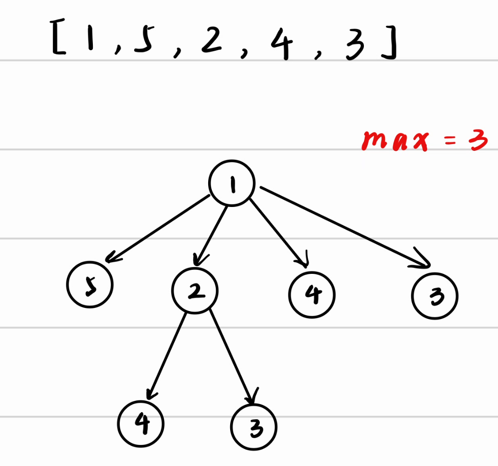

## 引入

:[simple-icons:leetcode]:[力扣300题最长递增子序列](https://leetcode.cn/problems/longest-increasing-subsequence/)

我们不妨用最朴素的思想来解决这个问题，即`暴力枚举`

从`1`出发，我们可以画出这样一副图，可以得到最长为3



我们对后面几个点进行同样的操作，再更新答案即可。我们可以用==递归==的思想来编写代码

```cpp
int dp(vector<int> a, int s) {
    int n = a.size();
    int ans = 1;
    for (int i = s + 1; i < n; i++) {
        if (a[i] > a[s]) {
            ans = max(ans, dp(a, i) + 1);
        }
    }
    return ans;
}
```

但是，这个算法会遍历每一个子序列（$2^N$），所以它的时间复杂度是==指数级==的，会超时，我们必须对它进行优化。

我们再次观察这个遍历树，会发现其中存在着大量的重复计算

比如我们在计算$1,2,4$，就已经计算过从$4$开始的最大子序列长度，为了避免重复计算，我们可以在第一次计算时，就将结果保留下来。

```cpp
int dp(vector<int> a, vector<pair<int, bool>>& m, int s) {
    int n = a.size();
    for (int i = s + 1; i < n; i++) {
        if (a[i] > a[s]) {
            m[s].first =
                max(m[s].first, m[i].second ? m[i].first + 1 : dp(a, m, i) + 1);
        }
    }
    m[s].second = true;
    return m[s].first;
}
```

因为使用`字典`或`哈希表`保存结果，因此也被称为`记忆化搜索`，以==空间换时间==。

## 非递归

有了的递归的算法，我们还可以将其改写为==非递归==的形式，这样我们可以更直观地去分析算法的时间复杂度，并且避免了递归时的函数调用开销。

观察之前的计算过程：
$$dp(0)=max\{dp(1),dp(2),dp(3),dp(4)\}+1$$
$$dp(1)=max\{dp(2),dp(3),dp(4)\}+1$$
$$dp(2)=max\{dp(3),dp(4)\}+1$$
$$dp(3)=max\{dp(4)\}+1$$
$$dp(4)=1$$

我们可以发现，我们只需要从后往前计算，就可以将所以的答案推算出来。

```cpp
for (int i = n - 1; i >= 0; i--) {
    for (int j = i + 1; j < n; j++) {
        if (a[j] > a[i]) m[i] = max(m[i], m[j]);
    }
    ans = max(ans, ++m[i]);
}
```

我们可以分析出这个算法的复杂度是$O(N^2)$

## 总结

1. 尝试暴力枚举
2. 缓存已计算过的值
3. 改写递归形式