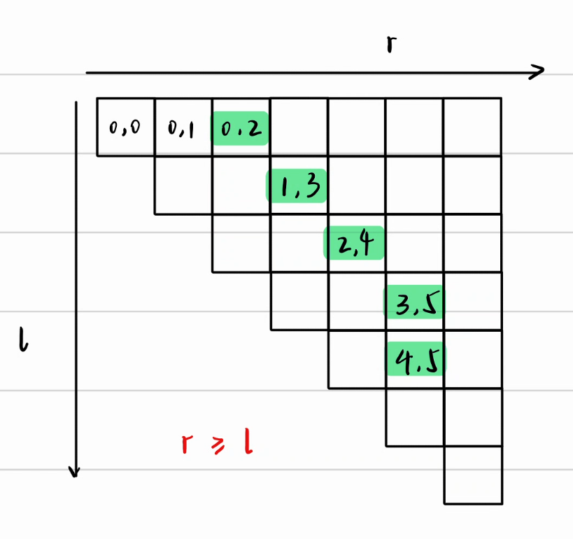
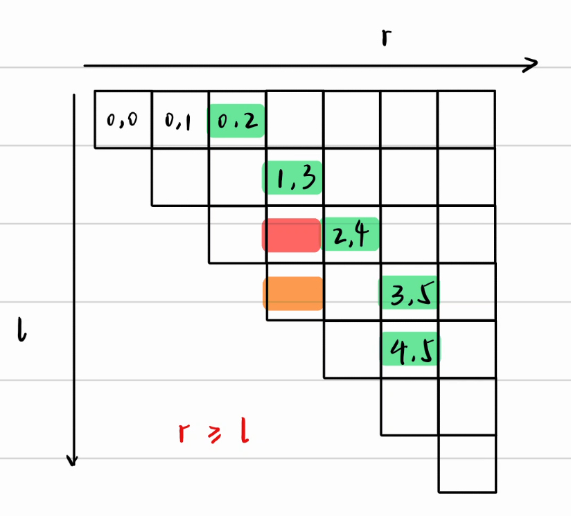

## 引入

:[simple-icons:leetcode]:[力扣209题长度最小的子数组](https://leetcode.cn/problems/minimum-size-subarray-sum/description/)

题目概要：给定正整数数组$arr$，目标值$target$，求最小区间，满足$sum \geq target$。

朴素的做法是枚举左右端点$l,r$，然后求区间和，再计算区间最小值，时间复杂度为$O(N^3)$，代码如下

```cpp
for (int l = 0; l < n; l++) {
    for (int r = l; r < n; r++) {
        int sum = 0;
        for (int i = l; i <= r; i++) sum += arr[i];
        if (sum >= target) ans = min(ans, r - l + 1);
    }
}
```

而我们学过==前缀和==，可以知道求区间和只需要$O(1)$，还可以添加一个`break`进行优化，时间复杂度降为了$O(N^2)$


```cpp
vector<int> sum(n);
partial_sum(arr.begin(), arr.end(), sum.begin());
auto getSum = [&](int l, int r) {
    if (l == 0) return sum[r];
    return sum[r] - sum[l - 1];
};
for (int l = 0; l < n; l++) {
    for (int r = l; r < n; r++) {
        if (getSum(l, r) >= target) {
            ans = min(ans, r - l + 1);
            break;
        }
    }
}
```

想要将复杂度降至更低，则需要更厉害的算法，由此引入==单调性枚举==

## 解释

观察这张图，我们用二维表来记录不同的$(l,r)$所对应的$case$

其中，绿色注明的点就是`break`时的点



我们不难得到三个规律

1. 高亮格左侧都`不满足`条件，因为所属区间必然小于满足条件的最小区间
2. 高亮格右侧都`满足`条件，因为所属区间必然大于满足条件的最小区间（因此我们才可以break）
3. $r$是单调递增的，我们来证明一下：




任意选择绿色块左侧的一个红色块，一定不满足条件，而它下面的橙色块区间更小，只有可能比它更不满足条件

所以，对于与红色块同一行的格子来说，只有当$r_{i+1} \geq r_i$，才可能找到满足条件的绿色块

有了这一规律，我们每一次枚举就只需要从上一次的$r$开始枚举即可

```cpp
vector<int> rightIdx(n);
for (int l = 0; l < n; l++) {
    int r = l == 0 ? 0 : rightIdx[l - 1];
    for (; r < n; r++) {
        if (getSum(l, r) >= target) {
            ans = min(ans, r - l + 1);
            break;
        }
    }
    rightIdx[l] = r;
}
```
这样，我们就得到了复杂度为$O(N)$的算法

> [!tip]
> 在这个图中，行进路线一定是往右或往下的，最多遍历$2N$个位置

我们还可以更进一步地优化这个代码

将$r$定义在外层，使其在整个枚举期间不会被重置
```cpp
for (int l = 0, r = 0; l < n; l++) {
    for (; r < n; r++) {
        if (getSum(l, r) >= target) {
            ans = min(ans, r - l + 1);
            break;
        }
    }
}
```
更进一步，我们不需要前缀和，可以在枚举时维护区间的关键值

```cpp
int sum = 0;
for (int l = 0, r = 0; l < n; l++) {
    
}
```


## 抽象

