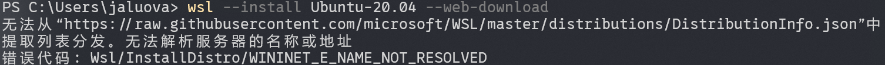
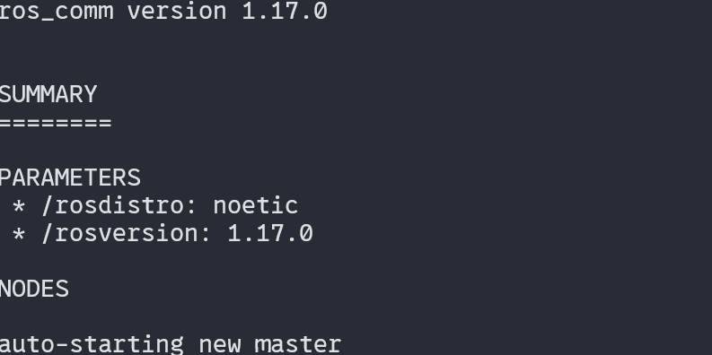
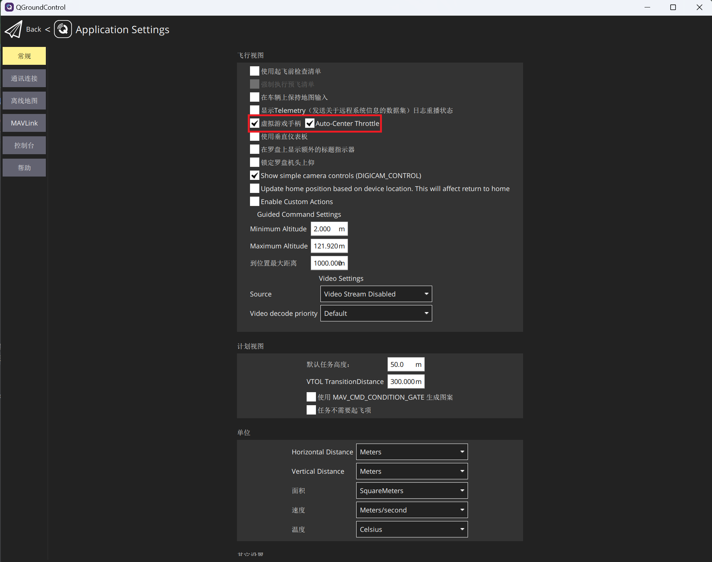
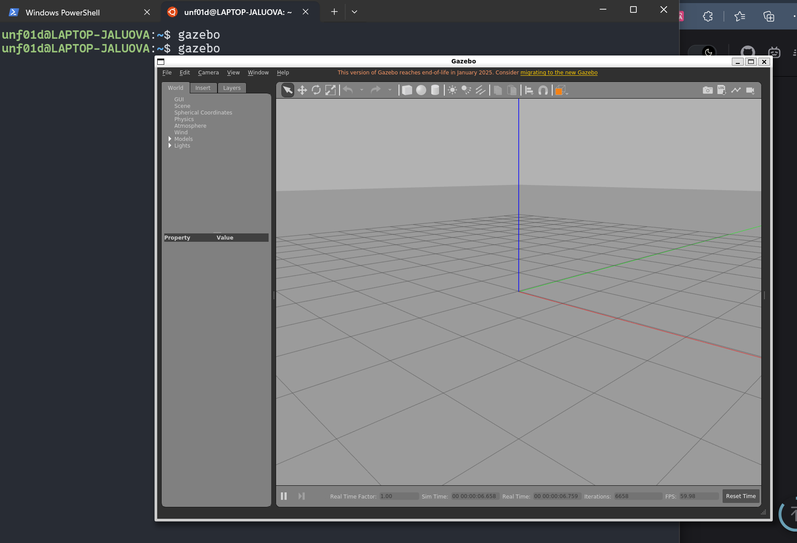
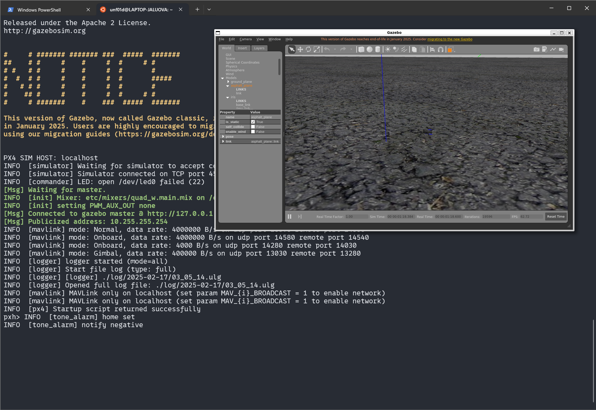
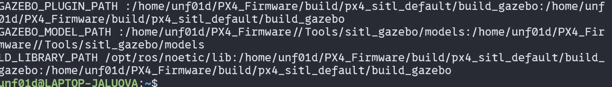
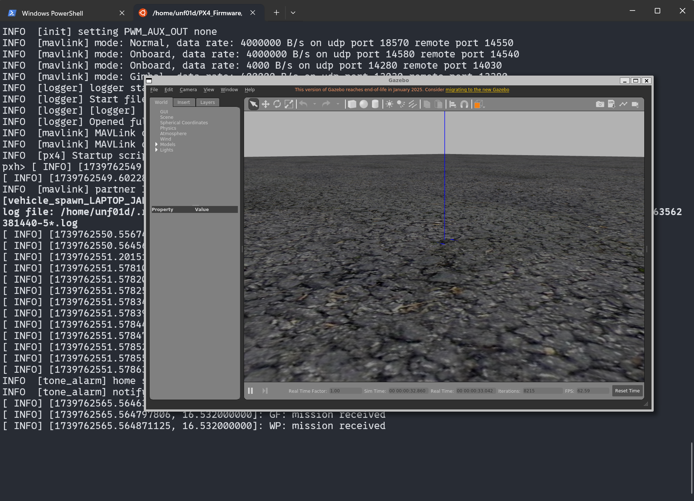
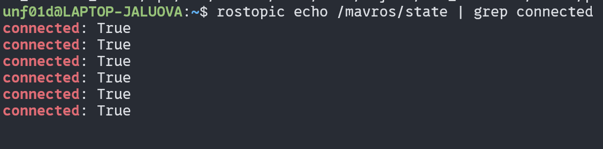
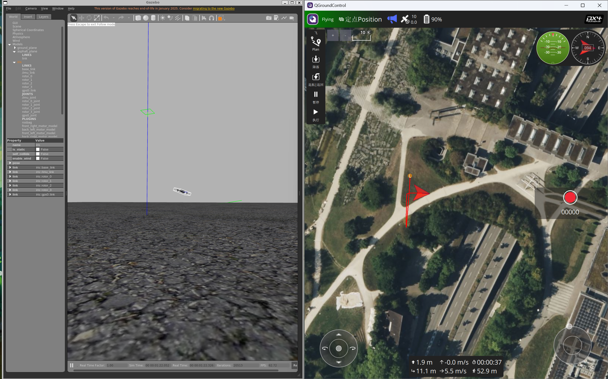

## 启用WSL服务

### 什么是WSL？如何使用？

@[bilibili](BV1tW42197za)

我们将基于视频中介绍的几点`便利功能`，搭建无人机仿真环境

### 下载Ubuntu

根据视频中的流程==开启windows系统的WSL服务==

接着，我们下载==Ubuntu20.04版本==（之后会解释为什么需要这个版本）

```sh
wsl --install Ubuntu-20.04 --web-download
```

> [!tip]
> 如果出现以下问题，可以下载[Watt Toolkit](https://steampp.net/)尝试加速
> 

### 基本配置

#### ==默认用户配置==

因为我们之后会进行大量`import`和`export`的备份操作，而在还原备份文件时，会默认为`root`用户，所以我们需要==将默认用户修改为我们自己创建的用户==

```sh
sudo vim /etc/wsl.conf
```
这里使用`vim`对文件内容进行编辑，初次使用可能会感觉有点`反人类😰`

首先，按`i`进入编辑模式（左下角出现`INSERT`）

然后，在文件中添加以下内容

```
[user]
default=你的用户名
```
最后，按`ESC`退出`INSERT`模式，按`:wq`来保存退出vim

> [!tip]
> 感兴趣的同学可以通过以下视频学习vim的基本用法
> @[bilibili](BV13t4y1t7Wg)

#### 显示优化（可选）

> [!warning]
> 此步设置仅供参考，最好还是不要执行，因为我后来发现了一些显示上的恶性bug

因为我们之后会用到gazebo的图形化窗口，可能会出现字体太小等问题，我们可以通过修改环境变量的方式来解决


```sh
vim ~/.bashrc
```
按住`shift+g`或者`大写的G`就可以跳转到文件底部，在底部添加

```
# >>> zoom application windows >>>
export QT_QPA_PLATFORM="wayland;xcb"
export QT_AUTO_SCREEN_SCALE_FACTOR=0
export QT_ENABLE_HIGHDPI_SCALING=0
export QT_SCALE_FACTOR=1.5 # 此处调节缩放比例
# <<< zoom application windows <<<
```
退出`vim`，并输入以使得刚刚的修改生效
```sh
source ~/.bashrc
```
> [!tip]
> .bashrc是bash终端的配置文件，感兴趣的同学可以自行搜索


#### ==vs code服务（十分重要！）==

使用vim是不是还挺麻烦的？其实我们可以用windows上的`vs code`来修改文件（为什么不早说😢）

首先，在vs code上找到`WSL`插件并下载,启用

接着，只需要在终端输入

```sh
code
```
等待下载完成就可以了！

## 安装ROS

**正片开始！**

我们使用小鱼ROS一键安装，原因就是这个脚本可以自动帮我们配置网络环境，找到合适的版本，安心省事！

```sh
wget http://fishros.com/install -O fishros
```
这个指令可以帮助我们下载到安装脚本

运行脚本

```sh
. fishros
```

接着我们跟着引导，选择安装ROS，由于我们还没换源，可以选择换源

接着我么选择==安装ROS1 noetic的桌面版==，因为我发现网上有关ROS1的教程会更多一些（这也是我为何选择Ubuntu20.04的原因）

安装完成后，我们可以新建一个终端，输入`roscore`查看是否安装成功



检查完毕，按住`ctrl+C`可以结束进程

> [!tip]
> 我们还可以用小鱼脚本安装rosdep（可选）

## 安装MAVROS

MAVROS是一个ROS（Robot Operating System）软件包 ，有了它就可以让ROS与飞控通信。

```sh
sudo apt install ros-$ROS_DISTRO-mavros ros-$ROS_DISTRO-mavros-extras
```

```sh
git clone https://gitee.com/tyx6/geographiclib_datasets_tools.git
cd geographiclib_datasets_tools/
chmod a+x ./install_geographiclib_datasets.sh
sudo ./install_geographiclib_datasets.sh
```

下载完成后输入`roscd mavros`,如果发现跳转到了`/opt/ros/noetic/share/mavros`目录，即代表安装成功

## 下载QGroundControl

前往官网[QGroundControl](https://qgroundcontrol.com/)，下载windows版本，可以直接与我们的linux子系统搭建的仿真环境联通！

安装windows版本的过程，类似于windows上下载其他应用的过程，所以这里就不赘述了

这里推荐启用虚拟手柄，方便控制



## 克隆PX4仓库

### 方法1：从github上克隆源代码（不推荐）

```sh
git clone https://github.com/PX4/PX4-Autopilot.git # 下载源码
mv PX4-Autopilot PX4_Firmware  # 更改目录名
```
```sh
cd PX4_Firmware
git checkout -b dev v1.13.2  # 切换版本
git submodule update --init --recursive   # 更新下载子模块
# 比较慢，可能需要使用镜像源
```

### 方法2：使用网盘或者从QQ群下载

```sh
# 在windows上的下载路径是以挂载卷的形式
mv 下载的路径/PX4_Firmware_v1.13.2.zip ~ # 移动到linux的工作目录里
# 当然，你也可以直接从资源管理器中拖过去
sudo apt install unzip # 下载解压工具
unzip PX4_Firmware_v1.13.2.zip
```

解压完成后，执行以下指令，添加可执行脚本

```sh
rm PX4_Firmware_v1.13.2.zip # 可以删除压缩包
cd PX4_Firmware
wget https://gitee.com/tyx6/mytools/raw/main/px4/set_executable.sh
chmod +x set_executable.sh  # 设置权限
./set_executable.sh         # 执行
```

## 安装相关依赖和gazebo

```sh
cd ~/PX4_Firmware/Tools/setup
chmod +x ubuntu.sh
./ubuntu.sh --no-nuttx 
# 脚本执行时间，跟个人网络有关，可能需要一段时间
```
> [!tip]
> 这是官方提供的脚本 有两个可选参数
>
> --no-sim-tools   不安装仿真环境
>
> --no-nuttx   不安装交叉编译环境
>
> 如果需要自己编译飞控固件，烧录到飞控中，那就需要交叉编译环境

```sh
sudo apt update && sudo apt upgrade
sudo apt-get install ros-$ROS_DISTRO-gazebo-ros-pkgs ros-$ROS_DISTRO-gazebo-ros-control
```

安装好后，输入`gazebo`验证是否安装完成


## 编译无人机仿真环境

```sh
cd ~/PX4_Firmware
make px4_sitl_default gazebo   # 这步可能有点慢，跟 ubuntu 的配置有关
```


可以看到小飞机了就可以

## 测试

编辑`.bashrc`

```sh
code ~/.bashrc
```
添加
```
# >>> PX4_Firmware >>>
# source ~/catkin_ws/devel/setup.bash  # 这个是个人的ROS工作空间，我们之后可以创建
source ~/PX4_Firmware/Tools/setup_gazebo.bash ~/PX4_Firmware/ ~/PX4_Firmware/build/px4_sitl_default
export ROS_PACKAGE_PATH=$ROS_PACKAGE_PATH:~/PX4_Firmware
export ROS_PACKAGE_PATH=$ROS_PACKAGE_PATH:~/PX4_Firmware/Tools/sitl_gazebo
# <<< PX4_Firmware <<<
```

保存退出并`source ~/.bashrc`

应该可以看到一段类似于这样的显示内容



这时候，我们就可以在任何目录下，启用仿真环境，输入

```sh
roslaunch px4 mavros_posix_sitl.launch
```




接着新建一个终端，运行下面命令，查看MAVROS与仿真无人机通信状况

```sh
rostopic echo /mavros/state | grep connected    # 只查看 connected 信息
```


> [!tip]
> rostopic echo /mavros/state可以查看全部信息
>
> `|`,`grep`指令搭配可以过滤输出内容，这些都是`shell`的基本用法

我们还可以打开QGC地面站来对无人机进行操控



## 总结 & 参考文章

OK😊!到此，我们的ROS1环境就基本配置完成了。我这篇文章主要参考的是[(最新)ubuntu搭建PX4无人机仿真环境(4) ——仿真环境搭建(以Ubuntu 18.04,ROS1 Melodic 为例)](https://blog.csdn.net/weixin_55944949/article/details/130895608)，也利用了不少相关资源，在此表示非常感谢！！

如果在配置过程中遇到了问题，请及时在底部评论区留言。